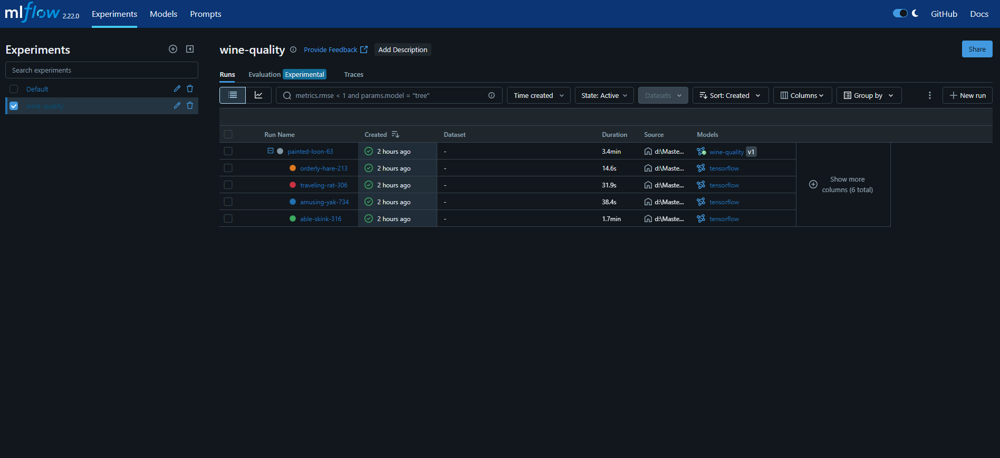
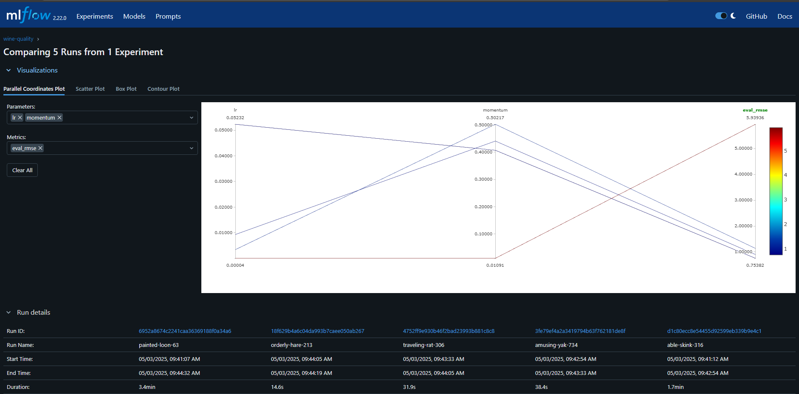
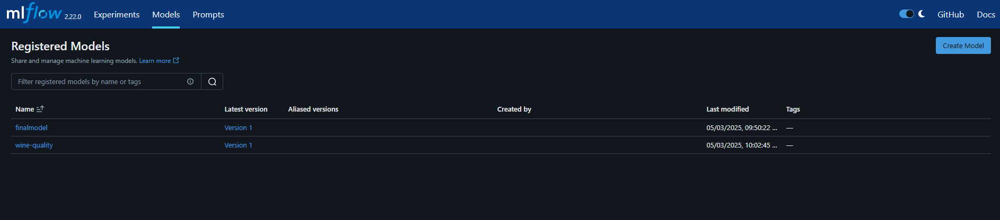

# 🍷 Wine Quality Prediction

This project builds a neural network model using **Keras** to predict the quality of white wine based on its physicochemical features. It uses **Hyperopt** for hyperparameter tuning and **MLflow** for experiment tracking.

---

## 📂 Dataset

The dataset is sourced from the UCI Machine Learning Repository:

- File: [`winequality-white.csv`](https://raw.githubusercontent.com/mlflow/mlflow/master/tests/datasets/winequality-white.csv)
- Features: 
  - Fixed acidity
  - Volatile acidity
  - Citric acid
  - Residual sugar
  - Chlorides
  - Free sulfur dioxide
  - Total sulfur dioxide
  - Density
  - pH
  - Sulphates
  - Alcohol
- Target: `quality` (score between 0 and 10)

---

## 🧪 Project Workflow

### 1. Data Preprocessing

- The dataset is split into:
  - 75% training data
  - 25% testing data
- The training set is further split into:
  - 80% training
  - 20% validation
- Feature normalization is applied based on training data statistics.

---

### 2. Model Architecture

A feed-forward artificial neural network:

```python
keras.Sequential([
    keras.Input([11]),
    keras.layers.Normalization(mean=..., variance=...),
    keras.layers.Dense(64, activation='relu'),
    keras.layers.Dense(1)
])
````

---

### 3. Hyperparameter Tuning

**Using Hyperopt:**

* **Algorithm:** Tree-structured Parzen Estimator (`tpe.suggest`)
* **Search Space:**

  ```python
  space = {
      "lr": hp.loguniform("lr", np.log(1e-5), np.log(1e-1)),
      "momentum": hp.uniform("momentum", 0.0, 1.0)
  }
  ```
* **Objective:** Minimize Root Mean Squared Error (RMSE) on validation set
* **Training Configuration:**

  * Epochs: 3
  * Batch Size: 64

---

### 4. Experiment Tracking with MLflow

* **MLflow Tracking** is used to log:

  * Parameters (`lr`, `momentum`)
  * Metrics (`eval_rmse`)
  * Trained model artifacts
* Best run (lowest validation RMSE) is logged and can be registered

---

## 📈 Metrics and Results

After running the hyperparameter search:

* The best RMSE on validation data is logged
* The corresponding model is available via MLflow for further use

---

## 💻 Installation

Install required Python packages:

```bash
pip install keras tensorflow pandas numpy hyperopt mlflow scikit-learn
```

---

## ▶️ How to Run

1. **Start MLflow UI**  after getting inside the folder DL_mlflow:

   ```bash
   mlflow ui
   ```

   Open [http://localhost:5000](http://localhost:5000) to view experiment results.

2. **Run the training script:**

   ```bash
   winequality.ipynb
   ```

---


## 🧠 Model Registry

* After the tuning process, the best model is saved.
* You can register this model in MLflow for deployment or comparison.
* Navigate to the MLflow UI to view, compare, and manage runs.

  

---
### Experiment Dashboard


### Comparison of different runs


### Model Registry



## 📌 Notes
* This code's main purpose is to **understand mlflow ui, model tracking, comparison and registry**
* The model uses a basic architecture and can be further improved.


---

## 📚 References

* [MLflow Documentation](https://mlflow.org/docs/latest/index.html)
* [Hyperopt Documentation](https://hyperopt.github.io/hyperopt/)


---

## 🧑‍💻 Author

*  Developed for educational purposes with an emphasis on practical ML pipeline integration.


